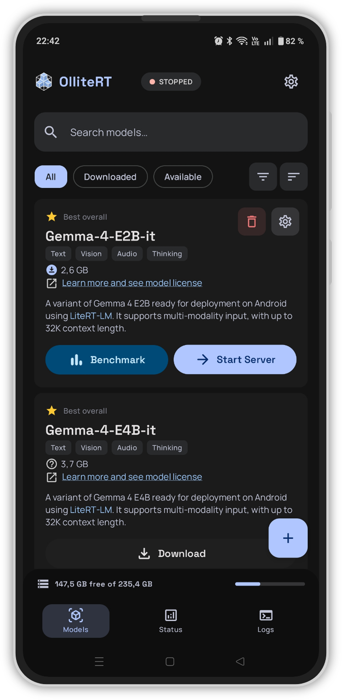
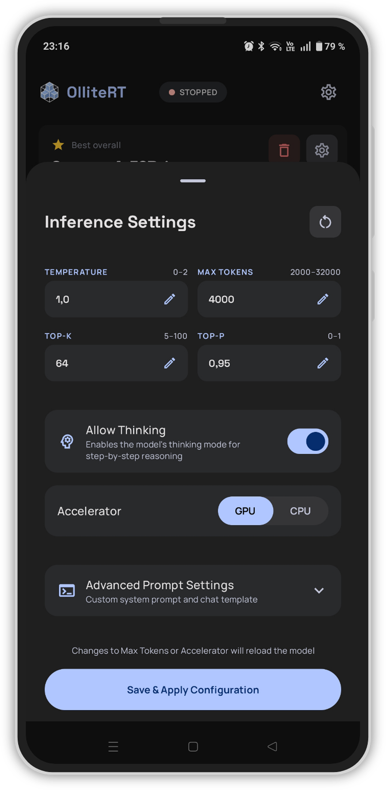
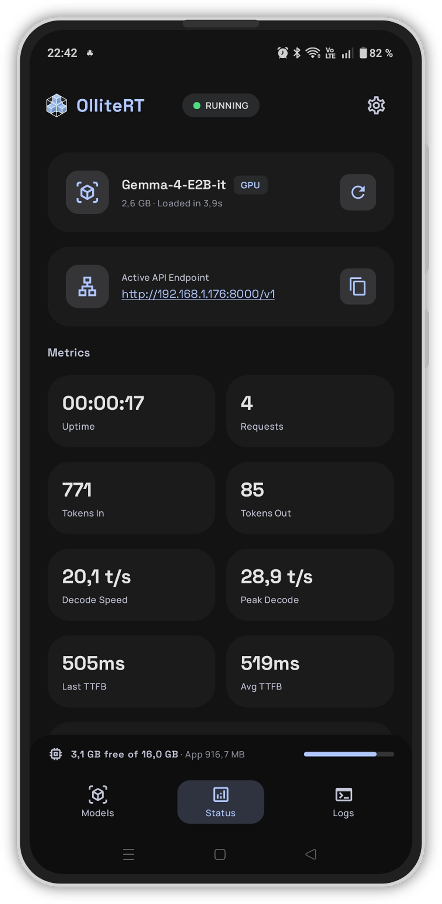
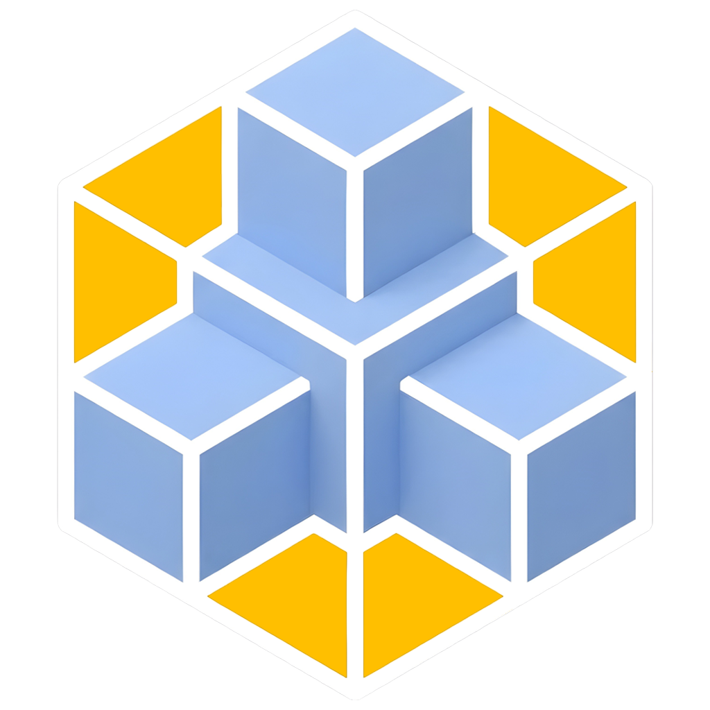
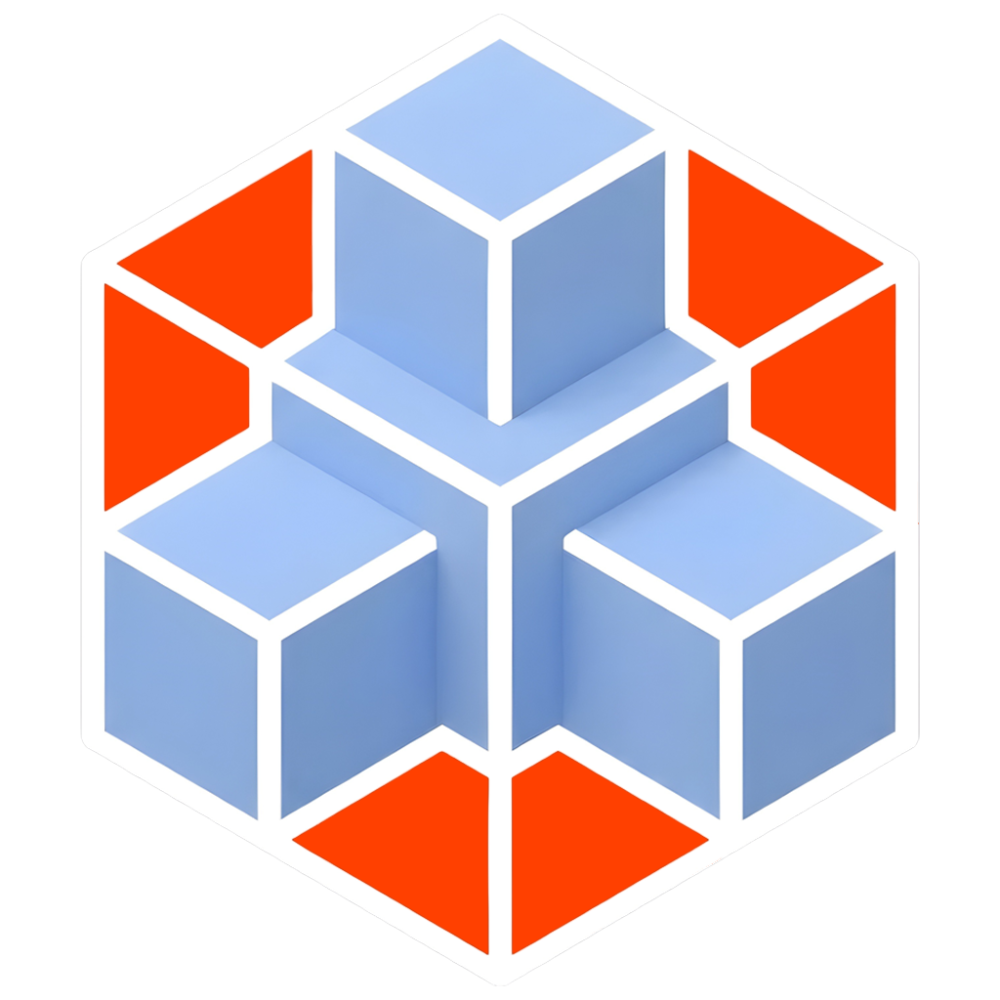

  

  <h1>OlliteRT</h1>

  [**Quick Start**](#quick-start) | [**Screenshots**](#screenshots) | 
  [**Features**](#features) | [**Models**](#supported-models) | [**Integrations**](#integrations) | [**API**](#api-endpoints) | [**FAQ**](#faq--troubleshooting) | 
  [**Report a bug**](#contributing) 

  
<strong>Turn your Android phone into an OpenAI-compatible API LLM server — fully local, private, and open source</strong>

  

    
    
    
     
    
    
  

## What is OlliteRT?

**Think of it as [Ollama](https://ollama.com) for Android.** If you've used Ollama on a PC or [llama.cpp](https://github.com/ggerganov/llama.cpp) on a server, OlliteRT brings the same concept to your Android phone — runs LLMs on your mobile GPU/CPU via Google's [LiteRT](https://ai.google.dev/edge/litert) runtime and serves them as a standard [OpenAI-compatible HTTP API](https://platform.openai.com/docs/api-reference) on your local network.

**No cloud. No API keys. No subscriptions. Just your phone.**

## Features

- **Free & private** — No cloud bills, no API keys, no data leaving your device
- **Multimodal & Reasoning** — Send images and audio to models that see, hear and think
- **Always on, low power** — Auto-starts on boot, sips ~3-5W vs 300W+ for a GPU server. Perfect for that old phone in your drawer.*
- **Benchmark built-in** — Test and compare models on your device to find the best fit for your hardware
- **Configurable** — Per-model inference settings, keep-alive with idle unload, bearer token auth, etc.
- **Model & Server monitoring** — Live in-app dashboard statistics, Prometheus metrics for Grafana dashboards, Home Assistant REST API for remote server control and settings updates
- **Bring your own model** — Download from HuggingFace with one tap or import your own `.litertlm` files from local storage
- **Works with everything** — Home Assistant, Open WebUI, OpenClaw, Python, curl — if it talks to OpenAI, it works

> [!NOTE]
> Home Assistant currently requires a custom integration such as [Extended OpenAI Conversation](https://github.com/jekalmin/extended_openai_conversation) or [Local OpenAI LLM](https://github.com/cavefire/local_openai_llm)

* I am not responsible for any swollen batteries, crispy phones, or spontaneous pocket warmers. Please don't run your LLM on your phone while it's under your pillow. You've been warned.

<strong>Full feature list (click to expand)</strong>

**API & Protocol**
- OpenAI-compatible API: `/v1/chat/completions`, `/v1/completions`, `/v1/responses`, `/v1/models`
- Real-time streaming via Server-Sent Events (SSE)
- Multimodal input — vision and audio for capable models (e.g. Gemma 4, Gemma 3n)
- Chain-of-thought thinking mode with supported models (e.g. Gemma 4)
- Tool/function calling (prompt-based — may not always be reliable due to on-device model limitations)
- Automatic prompt compaction when conversations exceed context window
- Bearer token authentication
- JSON mode, CORS

**Server & Lifecycle**
- Auto-start server on device boot
- Auto-start server on app launch
- Keep-alive with configurable idle model unload
- Per-model settings (temperature, top-k, top-p, max tokens)
- GPU / CPU accelerator selection

**Monitoring & Observability**
- Live status dashboard with real-time throughput, latency, and TTFB
- Built-in model benchmark (prefill speed, decode speed, time to first token)
- Health endpoint at `/health` with optional `?metrics=true` for detailed stats
- Structured request/response logs with search, filtering, and JSON highlighting

**Built-in Integrations**
- [Prometheus metrics](docs/integrations/PROMETHEUS.md) — `/metrics` endpoint (22 metrics) for Grafana, Datadog, etc.
- [Home Assistant REST API](docs/integrations/HOME_ASSISTANT.md) — monitor server status, control model, update settings remotely

**Model Management**
- One-tap model download from HuggingFace
- Import `.litertlm` files from local storage
- Per-model capability indicators (text, vision, audio, thinking, tools)

## Screenshots

  
    
  
  

## Quick Start

1. **Download & install** the APK — pick the one matching your device architecture (most phones are **arm64-v8a**)
    
2. **Download a model** — **Gemma 4 E2B** is recommended
3. **Start the server** — Tap the Start Server button on the downloaded model card
4. **Connect** — Use the endpoint shown on the Status screen (e.g. `http://PHONE_IP:8000/v1`) with your favorite OpenAI-compatible client e.g. Open WebUI, OpenClaw, Home Assistant, Python scripts, etc.

> [!IMPORTANT]
> Requires: Android 12+ · **arm64-v8a** or x86_64 device · 6 GB RAM minimum · 8 GB+ recommended for multimodal models (see [model table](#supported-models))

---

## Supported Models

<strong>Available LLM models — click to expand</strong>

| Model | Size | Context | Capabilities | Min RAM |
|:------|-----:|--------:|:-------------|--------:|
| **Gemma 4 E2B** | 2.4 GB | 32K | Text · Vision · Audio · Thinking · Tools | 8 GB |
| **Gemma 4 E4B** | 3.4 GB | 32K | Text · Vision · Audio · Thinking · Tools | 12 GB |
| **Gemma 3n E2B** | 3.4 GB | 4K | Text · Vision · Audio | 8 GB |
| **Gemma 3n E4B** | 4.6 GB | 4K | Text · Vision · Audio | 12 GB |
| **Gemma 3 1B** | 0.5 GB | 1K | Text | 6 GB |
| **Qwen 2.5 1.5B** | 1.5 GB | 4K | Text | 6 GB |
| **DeepSeek-R1 1.5B** | 1.7 GB | 4K | Text | 6 GB |

Models are downloaded from [HuggingFace](https://huggingface.co/litert-community) in `.litertlm` format. You can also import your own compatible models from local storage.

Which model should you pick? See the **[Model Guide](docs/MODELS.md)** for recommendations, capability details, and import instructions.

## Integrations

OlliteRT works with any tool that supports the OpenAI API — Home Assistant, Open WebUI, OpenClaw, Python, curl, Prometheus, and more.

See the full integration guides: **[docs/INTEGRATIONS.md](docs/INTEGRATIONS.md)**

## API Endpoints

| Method | Endpoint | Description |
|:-------|:---------|:------------|
| `POST` | `/v1/chat/completions` | OpenAI Chat Completions API (streaming + non-streaming) |
| `POST` | `/v1/completions` | OpenAI Completions API |
| `POST` | `/v1/responses` | OpenAI Responses API |
| `GET`  | `/v1/models` | List available models |
| `GET`  | `/metrics` | Prometheus metrics |
| `GET`  | `/health` | Health check (with optional `?metrics=true`) |

Full API documentation, supported parameters, and examples: **[docs/api/API.md](docs/api/API.md)**

## Limitations

<strong>Known limitations — click to expand</strong>

- **arm64-v8a and x86_64 only** — 32-bit devices (armeabi-v7a, x86) are not supported because the LiteRT runtime does not ship native libraries for those architectures. Nearly all Android devices from 2017+ are 64-bit.
- **One model at a time** — only one model can be loaded and serving at any given time
- **One request at a time** — requests are processed sequentially (LiteRT SDK limitation), additional requests queue until the current one finishes
- **Tool calling is prompt-based** — not natively constrained, so results may vary depending on the model
- **Token counts are estimated** — the LiteRT runtime doesn't expose a tokenizer API, so counts use a character-based approximation
- **No GGUF support** — only `.litertlm` models are supported (LiteRT runtime limitation)
- **No embeddings API** — not supported by the LiteRT runtime
- **Model files are copied to app storage** — imported models are duplicated due to Android scoped storage + LiteRT SDK requiring file paths
- **Context windows are model-dependent** — smaller models are limited to 1K–4K tokens
- **LiteRT runtime constraints** — unlike Ollama or llama.cpp, OlliteRT is built on Google's [LiteRT](https://ai.google.dev/edge/litert) runtime which is optimized for mobile but doesn't support features like logprobs, grammar-based output constraints, repetition penalties, or LoRA adapters

## FAQ & Troubleshooting

Connection issues, performance tips, model questions, tool calling, Home Assistant setup — **[docs/FAQ.md](docs/FAQ.md)**

## Security 

- **[Security](docs/SECURITY.md)** — bearer token authentication, network exposure, HTTPS, and recommendations for securing your server

## Building from Source

See [docs/BUILDING.md](docs/BUILDING.md) for build instructions, signing setup, and HuggingFace OAuth configuration.

Product flavors — all installable side-by-side:

| Flavor | Icon | Purpose |
|:-------|:----:|:--------|
| `prod` |  | Stable release |
| `beta` |  | Beta testing |
| `dev` |  | Local development |

## Architecture

See **[docs/ARCHITECTURE.md](docs/ARCHITECTURE.md)** for the internal architecture, package structure, threading model, and request flow.

## Contributing

Contributions are welcome! Please check [open issues](https://github.com/NightMean/ollitert/issues) for things to work on.

- Found a bug or want to request a feature? [Report it here](https://github.com/NightMean/ollitert/issues/new?template=01_bug_report.yml)

## Support the Project

If OlliteRT is useful to you, consider supporting the development:

  &nbsp;
  &nbsp;
  

## Star History

  <a href="https://star-history.com/#NightMean/ollitert&Date">
    <picture>
      <source media="(prefers-color-scheme: dark)" srcset="https://api.star-history.com/svg?repos=NightMean/ollitert&type=Date&theme=dark" />
      <source media="(prefers-color-scheme: light)" srcset="https://api.star-history.com/svg?repos=NightMean/ollitert&type=Date" />
      
    </picture>
  </a>

